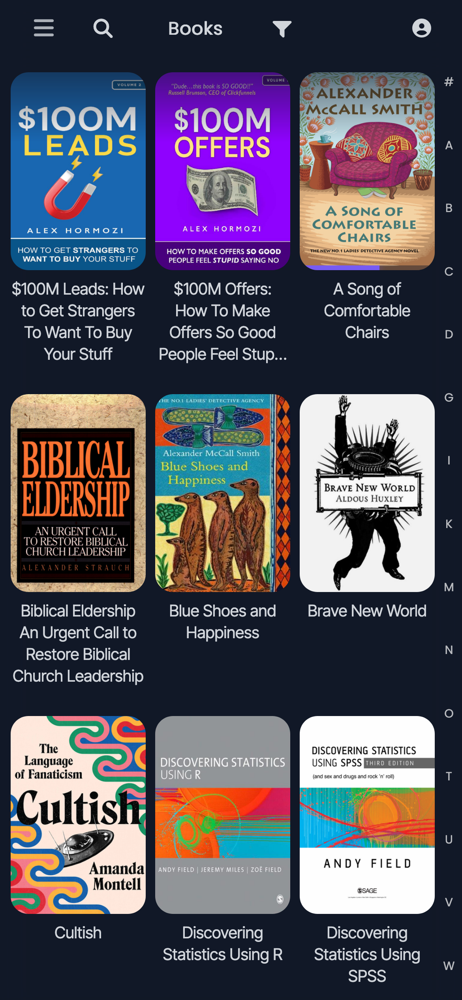
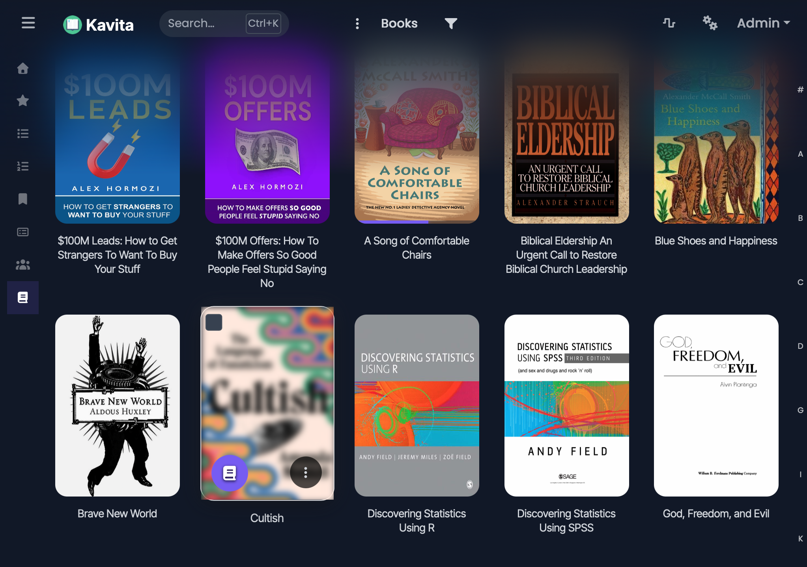

# Why ElegantFin
- Intentionally designed, not just re‑colored — ElegantFin reshapes spacing, depth, and hierarchy so the library reads cleanly at a glance.
- Inspired by the [Jellyfin theme of the same name](https://github.com/lscambo13/ElegantFin).
- **Kavita compatibility:** 0.8.8.3

Navbar & Chrome
- A soft “glass” header with gentle glow effects.

Book Cards & Library Grid
- Book cards decluttered—icons appear on hover.
- Long title space—removed icons that encroached, and allow multi-line titles.
- Rounded corners, beautiful animations on hover.

Reading Progress & Metadata
- Subtle progress cues never overpower cover art.

Mobile & Compact Screens
- Uses space efficiently so you see more books, not padding.
- Maintains legibility and card clarity even on smaller devices.
- Feels like a mobile‑first layout rather than a squeezed desktop view.

Previews

